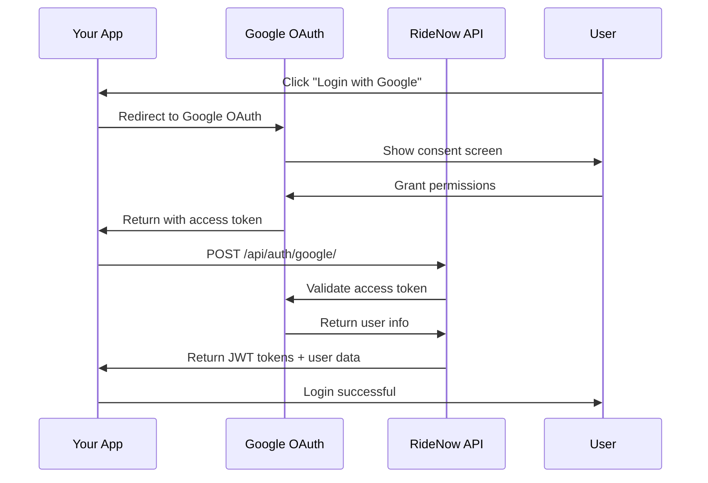
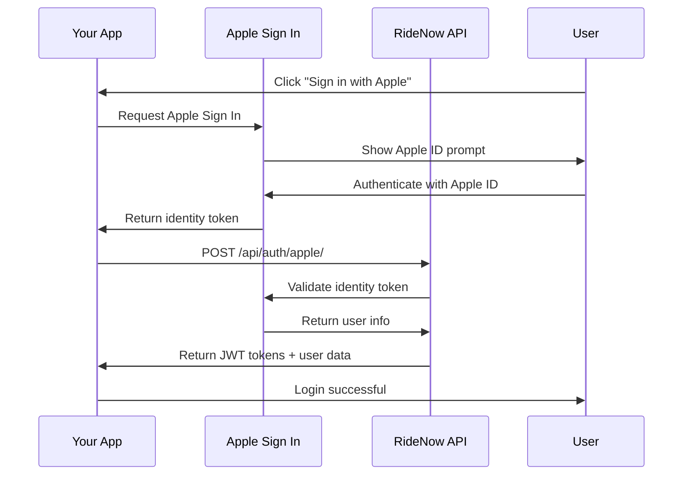

# Social Authentication API Integration Guide

## Overview

This guide provides step-by-step instructions for integrating RideNow's social authentication APIs into your applications. The APIs support both Google OAuth 2.0 and Apple Sign In for seamless user authentication.

## Table of Contents

1. [Getting Started](#getting-started)
2. [Authentication Flow](#authentication-flow)
3. [API Reference](#api-reference)
4. [Integration Examples](#integration-examples)
5. [Error Handling](#error-handling)
6. [Security Best Practices](#security-best-practices)
7. [Testing](#testing)

## Getting Started

### Prerequisites

- Valid Google OAuth 2.0 credentials (for Google integration)
- Valid Apple Sign In credentials (for Apple integration)
- HTTPS-enabled domain (required for production)
- API access to RideNow platform

### Base URL

```
Production: https://yourdomain.com/api/auth/
Development: http://localhost:8000/api/auth/
```

### Authentication

All API endpoints require proper authentication headers:

```http
Authorization: Bearer <access_token>
Content-Type: application/json
```

## Authentication Flow

### 1. Google OAuth Flow



### 2. Apple Sign In Flow



## API Reference

### 1. Google Social Login

**Endpoint:** `POST /api/auth/google/`

**Description:** Authenticate user with Google OAuth access token

**Request:**
```http
POST /api/auth/google/
Content-Type: application/json

{
    "access_token": "ya29.a0AfH6SMC..."
}
```

**Response (200 OK):**
```json
{
    "success": true,
    "message": "Google login successful",
    "access": "eyJ0eXAiOiJKV1QiLCJhbGciOiJIUzI1NiJ9...",
    "refresh": "eyJ0eXAiOiJKV1QiLCJhbGciOiJIUzI1NiJ9...",
    "user": {
        "id": 123,
        "username": "user@example.com",
        "email": "user@example.com",
        "first_name": "John",
        "last_name": "Doe",
        "is_client": true,
        "is_driver": false,
        "profile_picture": "https://lh3.googleusercontent.com/a/..."
    },
    "redirect_url": "/rides/dashboard/"
}
```

**Response (400 Bad Request):**
```json
{
    "success": false,
    "error": "Google access token is required"
}
```

**Response (401 Unauthorized):**
```json
{
    "success": false,
    "error": "Invalid Google access token"
}
```

### 2. Apple Social Login

**Endpoint:** `POST /api/auth/apple/`

**Description:** Authenticate user with Apple Sign In identity token

**Request:**
```http
POST /api/auth/apple/
Content-Type: application/json

{
    "identity_token": "eyJraWQiOiJXNldjT0tCIiwiYWxnIoiJSUzI1NiIs...",
    "authorization_code": "c1a2b3c4d5e6f7g8h9i0j1k2l3m4n5o6p7q8r9s0t1u2v3w4x5y6z7",
    "user": {
        "name": {
            "firstName": "John",
            "lastName": "Doe"
        }
    }
}
```

**Response (200 OK):**
```json
{
    "success": true,
    "message": "Apple login successful",
    "access": "eyJ0eXAiOiJKV1QiLCJhbGciOiJIUzI1NiJ9...",
    "refresh": "eyJ0eXAiOiJKV1QiLCJhbGciOiJIUzI1NiJ9...",
    "user": {
        "id": 123,
        "username": "user@example.com",
        "email": "user@example.com",
        "first_name": "John",
        "last_name": "Doe",
        "is_client": true,
        "is_driver": false
    },
    "redirect_url": "/rides/dashboard/"
}
```

### 3. Get Social Login URLs

**Endpoint:** `GET /api/auth/social/urls/`

**Description:** Get OAuth URLs and configuration for social providers

**Request:**
```http
GET /api/auth/social/urls/
```

**Response (200 OK):**
```json
{
    "success": true,
    "urls": {
        "google": {
            "auth_url": "https://yourdomain.com/accounts/google/login/",
            "callback_url": "https://yourdomain.com/accounts/google/login/callback/",
            "client_id": "123456789-abcdefghijklmnop.apps.googleusercontent.com",
            "scope": "profile email"
        },
        "apple": {
            "auth_url": "https://yourdomain.com/accounts/apple/login/",
            "callback_url": "https://yourdomain.com/accounts/apple/login/callback/",
            "client_id": "com.yourcompany.yourapp",
            "scope": "name email"
        }
    }
}
```

### 4. Get Connected Social Accounts

**Endpoint:** `GET /api/auth/social/accounts/`

**Description:** Get list of connected social accounts for authenticated user

**Request:**
```http
GET /api/auth/social/accounts/
Authorization: Bearer <access_token>
```

**Response (200 OK):**
```json
{
    "success": true,
    "accounts": [
        {
            "id": 1,
            "provider": "google",
            "provider_display": "Google",
            "uid": "123456789012345678901",
            "date_joined": "2024-01-15T10:30:00Z",
            "extra_data": {
                "email": "user@example.com",
                "given_name": "John",
                "family_name": "Doe",
                "picture": "https://lh3.googleusercontent.com/a/..."
            }
        },
        {
            "id": 2,
            "provider": "apple",
            "provider_display": "Apple",
            "uid": "001234.5678901234567890.1234",
            "date_joined": "2024-01-20T14:45:00Z",
            "extra_data": {
                "email": "user@example.com",
                "name": {
                    "firstName": "John",
                    "lastName": "Doe"
                }
            }
        }
    ]
}
```

### 5. Disconnect Social Account

**Endpoint:** `POST /api/auth/social/disconnect/`

**Description:** Disconnect a social account from user profile

**Request:**
```http
POST /api/auth/social/disconnect/
Authorization: Bearer <access_token>
Content-Type: application/json

{
    "provider": "google"
}
```

**Response (200 OK):**
```json
{
    "success": true,
    "message": "Google account disconnected successfully"
}
```

**Response (404 Not Found):**
```json
{
    "success": false,
    "error": "Google account not found"
}
```

## Integration Examples

### 1. JavaScript/Web Integration

#### Basic Implementation
```javascript
class SocialAuth {
    constructor(baseURL) {
        this.baseURL = baseURL;
    }
    
    async googleLogin(accessToken) {
        try {
            const response = await fetch(`${this.baseURL}/google/`, {
                method: 'POST',
                headers: {
                    'Content-Type': 'application/json',
                },
                body: JSON.stringify({
                    access_token: accessToken
                })
            });
            
            const data = await response.json();
            
            if (data.success) {
                // Store tokens
                localStorage.setItem('access_token', data.access);
                localStorage.setItem('refresh_token', data.refresh);
                
                return {
                    success: true,
                    user: data.user,
                    redirectUrl: data.redirect_url
                };
            } else {
                throw new Error(data.error);
            }
        } catch (error) {
            return {
                success: false,
                error: error.message
            };
        }
    }
    
    async appleLogin(identityToken, userInfo) {
        try {
            const response = await fetch(`${this.baseURL}/apple/`, {
                method: 'POST',
                headers: {
                    'Content-Type': 'application/json',
                },
                body: JSON.stringify({
                    identity_token: identityToken,
                    user: userInfo
                })
            });
            
            const data = await response.json();
            
            if (data.success) {
                // Store tokens
                localStorage.setItem('access_token', data.access);
                localStorage.setItem('refresh_token', data.refresh);
                
                return {
                    success: true,
                    user: data.user,
                    redirectUrl: data.redirect_url
                };
            } else {
                throw new Error(data.error);
            }
        } catch (error) {
            return {
                success: false,
                error: error.message
            };
        }
    }
    
    async getConnectedAccounts() {
        try {
            const accessToken = localStorage.getItem('access_token');
            
            const response = await fetch(`${this.baseURL}/social/accounts/`, {
                headers: {
                    'Authorization': `Bearer ${accessToken}`
                }
            });
            
            const data = await response.json();
            
            if (data.success) {
                return data.accounts;
            } else {
                throw new Error(data.error);
            }
        } catch (error) {
            console.error('Error fetching connected accounts:', error);
            return [];
        }
    }
    
    async disconnectAccount(provider) {
        try {
            const accessToken = localStorage.getItem('access_token');
            
            const response = await fetch(`${this.baseURL}/social/disconnect/`, {
                method: 'POST',
                headers: {
                    'Authorization': `Bearer ${accessToken}`,
                    'Content-Type': 'application/json'
                },
                body: JSON.stringify({ provider })
            });
            
            const data = await response.json();
            
            if (data.success) {
                return { success: true, message: data.message };
            } else {
                throw new Error(data.error);
            }
        } catch (error) {
            return { success: false, error: error.message };
        }
    }
}

// Usage
const auth = new SocialAuth('https://yourdomain.com/api/auth');

// Google login
const googleResult = await auth.googleLogin(googleAccessToken);
if (googleResult.success) {
    console.log('User logged in:', googleResult.user);
    window.location.href = googleResult.redirectUrl;
}

// Apple login
const appleResult = await auth.appleLogin(appleIdentityToken, appleUserInfo);
if (appleResult.success) {
    console.log('User logged in:', appleResult.user);
    window.location.href = appleResult.redirectUrl;
}
```

#### Advanced Implementation with Error Handling
```javascript
class AdvancedSocialAuth extends SocialAuth {
    constructor(baseURL, options = {}) {
        super(baseURL);
        this.options = {
            retryAttempts: 3,
            retryDelay: 1000,
            timeout: 10000,
            ...options
        };
    }
    
    async makeRequest(url, options = {}) {
        const controller = new AbortController();
        const timeoutId = setTimeout(() => controller.abort(), this.options.timeout);
        
        try {
            const response = await fetch(url, {
                ...options,
                signal: controller.signal
            });
            
            clearTimeout(timeoutId);
            
            if (!response.ok) {
                throw new Error(`HTTP ${response.status}: ${response.statusText}`);
            }
            
            return await response.json();
        } catch (error) {
            clearTimeout(timeoutId);
            throw error;
        }
    }
    
    async googleLoginWithRetry(accessToken) {
        let lastError;
        
        for (let attempt = 1; attempt <= this.options.retryAttempts; attempt++) {
            try {
                const data = await this.makeRequest(`${this.baseURL}/google/`, {
                    method: 'POST',
                    headers: { 'Content-Type': 'application/json' },
                    body: JSON.stringify({ access_token: accessToken })
                });
                
                if (data.success) {
                    return { success: true, data };
                } else {
                    throw new Error(data.error);
                }
            } catch (error) {
                lastError = error;
                
                if (attempt < this.options.retryAttempts) {
                    await new Promise(resolve => 
                        setTimeout(resolve, this.options.retryDelay * attempt)
                    );
                }
            }
        }
        
        return { success: false, error: lastError.message };
    }
}
```

### 2. React Native Integration

#### Google Sign In
```javascript
import { GoogleSignin } from '@react-native-google-signin/google-signin';
import AsyncStorage from '@react-native-async-storage/async-storage';

class ReactNativeSocialAuth {
    constructor(baseURL) {
        this.baseURL = baseURL;
        this.configureGoogleSignIn();
    }
    
    configureGoogleSignIn() {
        GoogleSignin.configure({
            webClientId: 'your_google_web_client_id',
            offlineAccess: true,
        });
    }
    
    async googleLogin() {
        try {
            // Check if Google Play Services are available
            await GoogleSignin.hasPlayServices();
            
            // Sign in with Google
            const userInfo = await GoogleSignin.signIn();
            
            // Authenticate with RideNow API
            const response = await fetch(`${this.baseURL}/google/`, {
                method: 'POST',
                headers: {
                    'Content-Type': 'application/json',
                },
                body: JSON.stringify({
                    access_token: userInfo.accessToken
                })
            });
            
            const data = await response.json();
            
            if (data.success) {
                // Store tokens securely
                await AsyncStorage.setItem('access_token', data.access);
                await AsyncStorage.setItem('refresh_token', data.refresh);
                
                return {
                    success: true,
                    user: data.user,
                    tokens: {
                        access: data.access,
                        refresh: data.refresh
                    }
                };
            } else {
                throw new Error(data.error);
            }
        } catch (error) {
            console.error('Google login error:', error);
            return {
                success: false,
                error: error.message
            };
        }
    }
    
    async appleLogin() {
        try {
            const { AppleAuthentication } = require('expo-apple-authentication');
            
            const credential = await AppleAuthentication.signInAsync({
                requestedScopes: [
                    AppleAuthentication.AppleAuthenticationScope.FULL_NAME,
                    AppleAuthentication.AppleAuthenticationScope.EMAIL,
                ],
            });
            
            const response = await fetch(`${this.baseURL}/apple/`, {
                method: 'POST',
                headers: {
                    'Content-Type': 'application/json',
                },
                body: JSON.stringify({
                    identity_token: credential.identityToken,
                    user: {
                        name: {
                            firstName: credential.fullName?.givenName || '',
                            lastName: credential.fullName?.familyName || ''
                        }
                    }
                })
            });
            
            const data = await response.json();
            
            if (data.success) {
                // Store tokens securely
                await AsyncStorage.setItem('access_token', data.access);
                await AsyncStorage.setItem('refresh_token', data.refresh);
                
                return {
                    success: true,
                    user: data.user,
                    tokens: {
                        access: data.access,
                        refresh: data.refresh
                    }
                };
            } else {
                throw new Error(data.error);
            }
        } catch (error) {
            console.error('Apple login error:', error);
            return {
                success: false,
                error: error.message
            };
        }
    }
    
    async logout() {
        try {
            // Sign out from Google
            await GoogleSignin.signOut();
            
            // Clear stored tokens
            await AsyncStorage.removeItem('access_token');
            await AsyncStorage.removeItem('refresh_token');
            
            return { success: true };
        } catch (error) {
            console.error('Logout error:', error);
            return { success: false, error: error.message };
        }
    }
}

// Usage in React Native component
import React, { useState } from 'react';
import { View, Button, Alert } from 'react-native';

const LoginScreen = () => {
    const [loading, setLoading] = useState(false);
    const auth = new ReactNativeSocialAuth('https://yourdomain.com/api/auth');
    
    const handleGoogleLogin = async () => {
        setLoading(true);
        const result = await auth.googleLogin();
        setLoading(false);
        
        if (result.success) {
            // Navigate to main app
            navigation.navigate('Dashboard');
        } else {
            Alert.alert('Login Failed', result.error);
        }
    };
    
    const handleAppleLogin = async () => {
        setLoading(true);
        const result = await auth.appleLogin();
        setLoading(false);
        
        if (result.success) {
            // Navigate to main app
            navigation.navigate('Dashboard');
        } else {
            Alert.alert('Login Failed', result.error);
        }
    };
    
    return (
        <View>
            <Button
                title="Login with Google"
                onPress={handleGoogleLogin}
                disabled={loading}
            />
            <Button
                title="Sign in with Apple"
                onPress={handleAppleLogin}
                disabled={loading}
            />
        </View>
    );
};
```

### 3. Flutter Integration

#### Google Sign In
```dart
import 'package:google_sign_in/google_sign_in.dart';
import 'package:http/http.dart' as http;
import 'dart:convert';
import 'package:shared_preferences/shared_preferences.dart';

class SocialAuthService {
  final String baseURL;
  final GoogleSignIn _googleSignIn = GoogleSignIn(
    scopes: ['email', 'profile'],
  );
  
  SocialAuthService({required this.baseURL});
  
  Future<Map<String, dynamic>> googleLogin() async {
    try {
      // Sign in with Google
      final GoogleSignInAccount? googleUser = await _googleSignIn.signIn();
      if (googleUser == null) {
        return {'success': false, 'error': 'User cancelled Google sign in'};
      }
      
      final GoogleSignInAuthentication googleAuth = 
          await googleUser.authentication;
      
      // Authenticate with RideNow API
      final response = await http.post(
        Uri.parse('$baseURL/google/'),
        headers: {'Content-Type': 'application/json'},
        body: jsonEncode({
          'access_token': googleAuth.accessToken,
        }),
      );
      
      final data = jsonDecode(response.body);
      
      if (data['success']) {
        // Store tokens securely
        final prefs = await SharedPreferences.getInstance();
        await prefs.setString('access_token', data['access']);
        await prefs.setString('refresh_token', data['refresh']);
        
        return {
          'success': true,
          'user': data['user'],
          'tokens': {
            'access': data['access'],
            'refresh': data['refresh'],
          }
        };
      } else {
        throw Exception(data['error']);
      }
    } catch (error) {
      return {'success': false, 'error': error.toString()};
    }
  }
  
  Future<Map<String, dynamic>> appleLogin() async {
    try {
      final SignInWithApple signInWithApple = SignInWithApple();
      
      final credential = await signInWithApple.getAppleIDCredential(
        scopes: [
          AppleIDAuthorizationScopes.email,
          AppleIDAuthorizationScopes.fullName,
        ],
      );
      
      // Authenticate with RideNow API
      final response = await http.post(
        Uri.parse('$baseURL/apple/'),
        headers: {'Content-Type': 'application/json'},
        body: jsonEncode({
          'identity_token': credential.identityToken,
          'user': {
            'name': {
              'firstName': credential.givenName ?? '',
              'lastName': credential.familyName ?? '',
            }
          }
        }),
      );
      
      final data = jsonDecode(response.body);
      
      if (data['success']) {
        // Store tokens securely
        final prefs = await SharedPreferences.getInstance();
        await prefs.setString('access_token', data['access']);
        await prefs.setString('refresh_token', data['refresh']);
        
        return {
          'success': true,
          'user': data['user'],
          'tokens': {
            'access': data['access'],
            'refresh': data['refresh'],
          }
        };
      } else {
        throw Exception(data['error']);
      }
    } catch (error) {
      return {'success': false, 'error': error.toString()};
    }
  }
  
  Future<Map<String, dynamic>> logout() async {
    try {
      // Sign out from Google
      await _googleSignIn.signOut();
      
      // Clear stored tokens
      final prefs = await SharedPreferences.getInstance();
      await prefs.remove('access_token');
      await prefs.remove('refresh_token');
      
      return {'success': true};
    } catch (error) {
      return {'success': false, 'error': error.toString()};
    }
  }
}

// Usage in Flutter widget
class LoginScreen extends StatefulWidget {
  @override
  _LoginScreenState createState() => _LoginScreenState();
}

class _LoginScreenState extends State<LoginScreen> {
  final SocialAuthService _authService = SocialAuthService(
    baseURL: 'https://yourdomain.com/api/auth',
  );
  bool _loading = false;
  
  Future<void> _handleGoogleLogin() async {
    setState(() => _loading = true);
    
    final result = await _authService.googleLogin();
    
    setState(() => _loading = false);
    
    if (result['success']) {
      // Navigate to main app
      Navigator.pushReplacementNamed(context, '/dashboard');
    } else {
      ScaffoldMessenger.of(context).showSnackBar(
        SnackBar(content: Text('Login failed: ${result['error']}')),
      );
    }
  }
  
  Future<void> _handleAppleLogin() async {
    setState(() => _loading = true);
    
    final result = await _authService.appleLogin();
    
    setState(() => _loading = false);
    
    if (result['success']) {
      // Navigate to main app
      Navigator.pushReplacementNamed(context, '/dashboard');
    } else {
      ScaffoldMessenger.of(context).showSnackBar(
        SnackBar(content: Text('Login failed: ${result['error']}')),
      );
    }
  }
  
  @override
  Widget build(BuildContext context) {
    return Scaffold(
      body: Center(
        child: Column(
          mainAxisAlignment: MainAxisAlignment.center,
          children: [
            ElevatedButton(
              onPressed: _loading ? null : _handleGoogleLogin,
              child: Text('Login with Google'),
            ),
            SizedBox(height: 16),
            ElevatedButton(
              onPressed: _loading ? null : _handleAppleLogin,
              child: Text('Sign in with Apple'),
            ),
          ],
        ),
      ),
    );
  }
}
```

## Error Handling

### Common Error Codes

| HTTP Status | Error Code | Description | Solution |
|-------------|------------|-------------|----------|
| 400 | `invalid_request` | Missing or invalid parameters | Check request body format |
| 401 | `invalid_token` | Invalid or expired token | Refresh token or re-authenticate |
| 403 | `access_denied` | Insufficient permissions | Check OAuth scopes |
| 404 | `account_not_found` | Social account not found | Check provider and user ID |
| 429 | `rate_limit_exceeded` | Too many requests | Implement exponential backoff |
| 500 | `internal_error` | Server error | Retry request or contact support |

### Error Response Format

```json
{
    "success": false,
    "error": "Error description",
    "code": "ERROR_CODE",
    "details": {
        "field": "Additional error details"
    }
}
```

### Error Handling Best Practices

```javascript
class ErrorHandler {
    static handleApiError(error, response) {
        if (response) {
            switch (response.status) {
                case 400:
                    return 'Invalid request. Please check your input.';
                case 401:
                    return 'Authentication failed. Please try again.';
                case 403:
                    return 'Access denied. Please check your permissions.';
                case 404:
                    return 'Resource not found.';
                case 429:
                    return 'Too many requests. Please try again later.';
                case 500:
                    return 'Server error. Please try again later.';
                default:
                    return 'An unexpected error occurred.';
            }
        }
        
        if (error.name === 'AbortError') {
            return 'Request timeout. Please check your connection.';
        }
        
        return 'Network error. Please check your connection.';
    }
    
    static async retryRequest(requestFn, maxRetries = 3) {
        let lastError;
        
        for (let attempt = 1; attempt <= maxRetries; attempt++) {
            try {
                return await requestFn();
            } catch (error) {
                lastError = error;
                
                if (attempt < maxRetries) {
                    const delay = Math.pow(2, attempt) * 1000; // Exponential backoff
                    await new Promise(resolve => setTimeout(resolve, delay));
                }
            }
        }
        
        throw lastError;
    }
}
```

## Security Best Practices

### 1. Token Security

```javascript
// Secure token storage
class SecureTokenStorage {
    static setToken(key, value) {
        // Use secure storage mechanisms
        if (typeof window !== 'undefined') {
            // Web: Use httpOnly cookies or secure localStorage
            localStorage.setItem(key, value);
        } else {
            // Mobile: Use secure storage
            // React Native: AsyncStorage with encryption
            // Flutter: SharedPreferences with encryption
        }
    }
    
    static getToken(key) {
        if (typeof window !== 'undefined') {
            return localStorage.getItem(key);
        } else {
            // Mobile: Retrieve from secure storage
            return null;
        }
    }
    
    static removeToken(key) {
        if (typeof window !== 'undefined') {
            localStorage.removeItem(key);
        } else {
            // Mobile: Remove from secure storage
        }
    }
}
```

### 2. Request Security

```javascript
// Secure API requests
class SecureApiClient {
    constructor(baseURL, options = {}) {
        this.baseURL = baseURL;
        this.options = {
            timeout: 10000,
            retryAttempts: 3,
            ...options
        };
    }
    
    async makeRequest(endpoint, options = {}) {
        const url = `${this.baseURL}${endpoint}`;
        const token = SecureTokenStorage.getToken('access_token');
        
        const requestOptions = {
            ...options,
            headers: {
                'Content-Type': 'application/json',
                ...(token && { 'Authorization': `Bearer ${token}` }),
                ...options.headers
            }
        };
        
        try {
            const response = await fetch(url, requestOptions);
            
            if (response.status === 401) {
                // Token expired, try to refresh
                const refreshed = await this.refreshToken();
                if (refreshed) {
                    // Retry request with new token
                    requestOptions.headers['Authorization'] = 
                        `Bearer ${SecureTokenStorage.getToken('access_token')}`;
                    return await fetch(url, requestOptions);
                }
            }
            
            return response;
        } catch (error) {
            throw error;
        }
    }
    
    async refreshToken() {
        try {
            const refreshToken = SecureTokenStorage.getToken('refresh_token');
            if (!refreshToken) return false;
            
            const response = await fetch(`${this.baseURL}/token/refresh/`, {
                method: 'POST',
                headers: { 'Content-Type': 'application/json' },
                body: JSON.stringify({ refresh: refreshToken })
            });
            
            const data = await response.json();
            
            if (data.success) {
                SecureTokenStorage.setToken('access_token', data.access);
                return true;
            }
            
            return false;
        } catch (error) {
            return false;
        }
    }
}
```

### 3. Input Validation

```javascript
// Input validation
class InputValidator {
    static validateGoogleToken(token) {
        if (!token || typeof token !== 'string') {
            throw new Error('Invalid Google access token');
        }
        
        if (token.length < 10) {
            throw new Error('Google access token too short');
        }
        
        return true;
    }
    
    static validateAppleToken(token) {
        if (!token || typeof token !== 'string') {
            throw new Error('Invalid Apple identity token');
        }
        
        try {
            // Basic JWT structure validation
            const parts = token.split('.');
            if (parts.length !== 3) {
                throw new Error('Invalid JWT structure');
            }
            
            return true;
        } catch (error) {
            throw new Error('Invalid Apple identity token format');
        }
    }
    
    static validateUserInfo(userInfo) {
        if (!userInfo || typeof userInfo !== 'object') {
            throw new Error('Invalid user information');
        }
        
        return true;
    }
}
```

## Testing

### 1. Unit Tests

```javascript
// Jest unit tests
describe('SocialAuth', () => {
    let auth;
    
    beforeEach(() => {
        auth = new SocialAuth('https://test-api.com/api/auth');
    });
    
    describe('googleLogin', () => {
        it('should successfully authenticate with valid Google token', async () => {
            const mockResponse = {
                success: true,
                access: 'mock_access_token',
                refresh: 'mock_refresh_token',
                user: { id: 1, email: 'test@example.com' }
            };
            
            global.fetch = jest.fn().mockResolvedValue({
                json: () => Promise.resolve(mockResponse)
            });
            
            const result = await auth.googleLogin('valid_google_token');
            
            expect(result.success).toBe(true);
            expect(result.user.email).toBe('test@example.com');
        });
        
        it('should handle invalid Google token', async () => {
            const mockResponse = {
                success: false,
                error: 'Invalid Google access token'
            };
            
            global.fetch = jest.fn().mockResolvedValue({
                json: () => Promise.resolve(mockResponse)
            });
            
            const result = await auth.googleLogin('invalid_token');
            
            expect(result.success).toBe(false);
            expect(result.error).toBe('Invalid Google access token');
        });
    });
    
    describe('appleLogin', () => {
        it('should successfully authenticate with valid Apple token', async () => {
            const mockResponse = {
                success: true,
                access: 'mock_access_token',
                refresh: 'mock_refresh_token',
                user: { id: 1, email: 'test@example.com' }
            };
            
            global.fetch = jest.fn().mockResolvedValue({
                json: () => Promise.resolve(mockResponse)
            });
            
            const result = await auth.appleLogin('valid_apple_token', {
                name: { firstName: 'John', lastName: 'Doe' }
            });
            
            expect(result.success).toBe(true);
            expect(result.user.email).toBe('test@example.com');
        });
    });
});
```

### 2. Integration Tests

```javascript
// Integration tests
describe('Social Auth Integration', () => {
    const baseURL = 'http://localhost:8000/api/auth';
    
    it('should complete Google OAuth flow', async () => {
        // Mock Google OAuth response
        const mockGoogleResponse = {
            access_token: 'mock_google_access_token',
            user: {
                email: 'test@example.com',
                given_name: 'John',
                family_name: 'Doe'
            }
        };
        
        // Test API endpoint
        const response = await fetch(`${baseURL}/google/`, {
            method: 'POST',
            headers: { 'Content-Type': 'application/json' },
            body: JSON.stringify({
                access_token: mockGoogleResponse.access_token
            })
        });
        
        const data = await response.json();
        
        expect(response.status).toBe(200);
        expect(data.success).toBe(true);
        expect(data.user.email).toBe('test@example.com');
    });
    
    it('should complete Apple Sign In flow', async () => {
        // Mock Apple Sign In response
        const mockAppleResponse = {
            identity_token: 'mock_apple_identity_token',
            user: {
                name: {
                    firstName: 'John',
                    lastName: 'Doe'
                }
            }
        };
        
        // Test API endpoint
        const response = await fetch(`${baseURL}/apple/`, {
            method: 'POST',
            headers: { 'Content-Type': 'application/json' },
            body: JSON.stringify(mockAppleResponse)
        });
        
        const data = await response.json();
        
        expect(response.status).toBe(200);
        expect(data.success).toBe(true);
        expect(data.user.first_name).toBe('John');
    });
});
```

### 3. End-to-End Tests

```javascript
// Cypress E2E tests
describe('Social Authentication E2E', () => {
    it('should complete Google login flow', () => {
        cy.visit('/login');
        
        // Mock Google OAuth
        cy.window().then((win) => {
            win.google = {
                accounts: {
                    oauth2: {
                        initTokenClient: () => ({
                            requestAccessToken: () => {
                                // Simulate successful OAuth
                                cy.window().then((win) => {
                                    win.googleAccessToken = 'mock_google_token';
                                });
                            }
                        })
                    }
                }
            };
        });
        
        // Click Google login button
        cy.get('[data-testid="google-login-btn"]').click();
        
        // Verify redirect to dashboard
        cy.url().should('include', '/dashboard');
        
        // Verify user is logged in
        cy.get('[data-testid="user-menu"]').should('be.visible');
    });
    
    it('should complete Apple login flow', () => {
        cy.visit('/login');
        
        // Mock Apple Sign In
        cy.window().then((win) => {
            win.AppleID = {
                auth: {
                    signIn: () => Promise.resolve({
                        authorization: {
                            id_token: 'mock_apple_token'
                        },
                        user: {
                            name: {
                                firstName: 'John',
                                lastName: 'Doe'
                            }
                        }
                    })
                }
            };
        });
        
        // Click Apple login button
        cy.get('[data-testid="apple-login-btn"]').click();
        
        // Verify redirect to dashboard
        cy.url().should('include', '/dashboard');
        
        // Verify user is logged in
        cy.get('[data-testid="user-menu"]').should('be.visible');
    });
});
```

## Support and Resources

### Documentation
- [Full Social Auth Documentation](./SOCIAL_AUTH.md)
- [Quick Reference Guide](./SOCIAL_AUTH_QUICK_REFERENCE.md)
- [API Documentation](./API_DOCUMENTATION.md)

### Community
- [GitHub Issues](https://github.com/yourorg/ridenow/issues)
- [Discord Community](https://discord.gg/ridenow)
- [Stack Overflow](https://stackoverflow.com/questions/tagged/ridenow)

### Contact
- **Email**: developers@ridenow.com
- **Slack**: #ridenow-dev
- **Twitter**: @RideNowDev

---

**API Integration Guide v1.0** | **Last Updated**: January 2024  
**Maintainer**: RideNow Development Team
